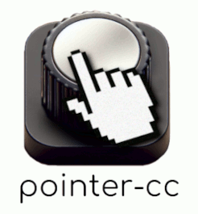
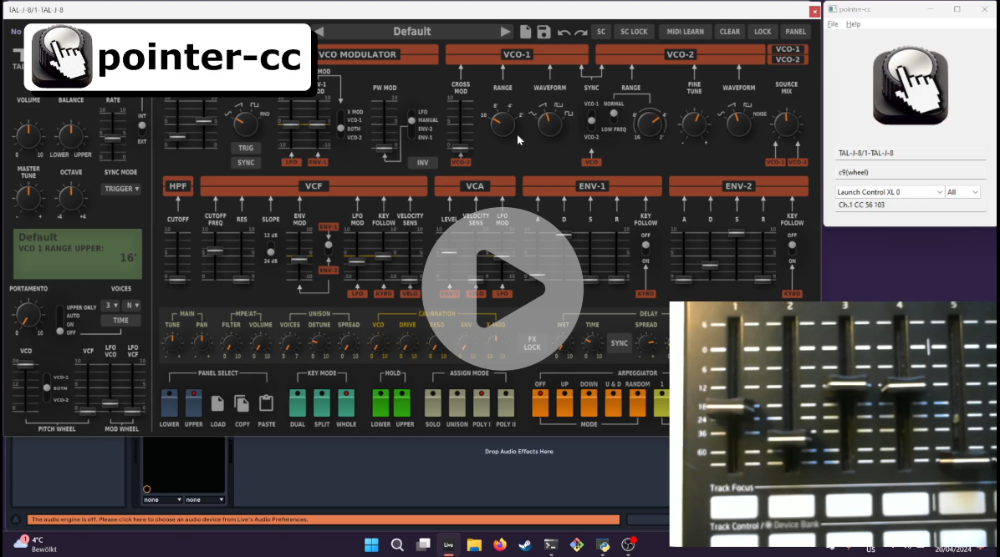
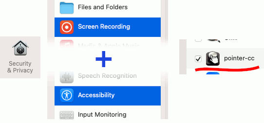
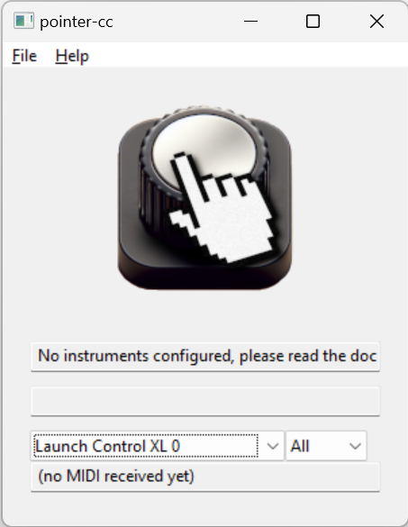
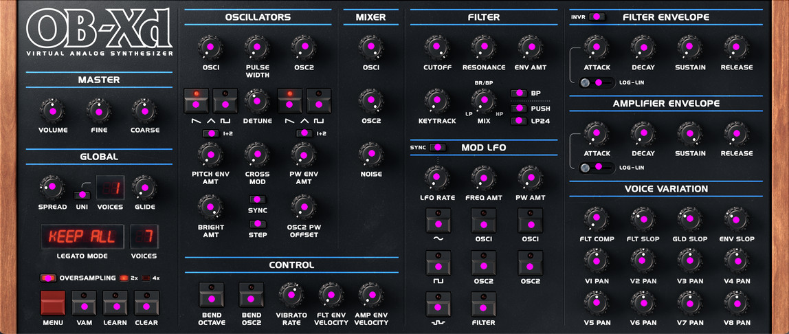

<p align="center">
  
</p>

Pointer-cc is an app that enables you to control all the control elemtns of your software instrument using just 4 kobs or sliders of your MIDI controller. Pointer-cc does this by simulating the mouse pointer inside the instrument's window.

NOTE: The app is in early development and may contain a lot of bugs. Please help me improving the software by submitting error repors or feedback as a Github issue or send to [pointer-cc@posteo.com](mailto:pointer-cc@posteo.com).

See Demo here:

[](https://youtu.be/hVVDJ-jgU80)

## Installation

You can download pointer-cc for both Mac and Windows from the [releases page](https://github.com/smatting/pointer-cc/releases). If you have a newer Mac with an M? chip, download the `.dmg` file that ends with `-arm64`. Otherwise, download the `.dmg` file that ends with `-x86_x64`. You can verify your Mac type under `About This Mac` in the Apple menu.


When running the Windows installer, you may encounter a warning about the installer coming from an "Unknown Publisher." This is because I (the author) have not bought a verified certificate, which requires an annual fee of 300 EUR. Optionally, you can add the [StefanMattingCA.cer](https://raw.githubusercontent.com/smatting/pointer-cc/main/certs/StefanMattingCA.cer) certificate to your trusted root certificates to remove this warning.

## Using pointer-cc

Upon first launch on a Mac, pointer-cc will request permissions for both "Screen Recording" and "Accessibility" to function properly. Navigate to "Security & Privacy" in your system settings and ensure permissions are enabled. Please restart the app afterward; sometimes, pointer-cc may not request all necessary permissions on the first attempt, requiring a second restart.

 



At the bottom of the main window, you can select your MIDI device and channel. If everything is set up correctly, MIDI messages should appear at the bottom as you interact.

To begin using pointer-cc, you'll need to configure instrument settings. Follow these steps:

1. Capture a screenshot of your instrument. Make sure you crop to the exact contents of the window, omit the window bar or borders.
2. Use a paint program (e.g. online [jspaint.app](https://jspaint.app), MS Paint or [GIMP](https://www.gimp.org/)) to mark all controls with points or rectangles in a distinct color not found in the screenshot. Note the exact RGB color code (e.g., `#ff00ff` or `R = 255, G = 0, B = 255`). You can omit controls you're not interested in. Here's an example:



   Save the marked screenshot as a PNG file.

3. In pointer-cc, select `Add Instrument` from the menu and follow the prompts.

After adding the instruments choose `Open Config Dir`. The configuration directory of pointer-cc contains two types of files:

- `config.txt`: The main configuration file.

- `inst-{some name}.txt`: Instrument configuration files (must start with `inst-` and end with `.txt`).

The config files use the [TOML](https://toml.io/en/) format.

The **main confguration** file `config.txt` looks like this

```toml
[bindings]
[bindings.1]
command = "pan-x"
cc = 77

[bindings.2]
command = "pan-y"
cc = 78

[bindings.3]
command = "adjust-control"
cc = 79

[bindings.4]
command = "freewheel"
cc = 80

[midi]
port = "Launch Control XL 0"
channel = 0

```

In the `[bindings]` section, you map MIDI control knobs to pointer-cc commands. To determine the correct `cc` field value, note the control number displayed in the MIDI status bar at the bottom of the pointer-cc window.

The `command` field specifies the action performed when adjusting the MIDI controller.

- `pan-x`: pan the cursor horizontally. A CC value `0` pans the pointer all the way left

- `pan-x-inv` pan the cursor horizonally. A CC value of `127` pans the pointer  all the way left

- `pan-y` pan the cursor vertically. A CC value `0` pans the pointer all the way up 

- `pan-y-inv` pan the cursor vertically. A CC value `127` pans the pointer all the way up

- `adjust-control` adjust the current control. What mouse pointer action is simulated depends on the configuration of current control element (See instrument configuration below)

- `freewheel` start freewheeling. While freewheeling you can turn the adjustment knob (knob mapped to `adjust-control`) in one direction without it having any effect. When you turn the adjustment knob in the other direction freewheeling stops and the adjustment knob has its effect again. Freewheeling is useful if you don't have an endless rotary knob on your midi controller.

The `[midi]` section updates automatically based on your MIDI settings within the application.

The instrument file that is generated in the "Add Instrument" window is meant to be edited manually after creating it. A typical **instrument configuration** file, e.g. `inst-jupiter8.txt` looks like this

```toml
[window]
contains = "TAL-J-8"

[default]
type = "wheel"

[default.drag]
speed = 1.0

[default.wheel]
speed = 0.3
time_resolution = 50

[dimensions]
width = 1439
height = 736

[controls]
[controls.c1]
x = 1074
y = 172
m = 1.0

[controls.c2]
type = "click"
x = 1033
y = 177
m = 1.0
```

- `window.contains` is used by pointer-cc to find the instrument window. Pick a string here that is contained in the window title of the instrument. It's usually the name of the instrument. Note that the case has to also match (comparison is case-sensitive).

- `controls` The `controls.c1`, `controls.c2`, ... sections correspond to the control elements that you marked in the screenshots. You can see the `c?` number that belongs to acontrol element in the pointer-cc window when you select it via the panning knobs.

- `controls.c1.x`: x coordinate of the control element (was extracted from screenshot)

- `controls.c1.y`: y coordinate of the control element (was extracted from screenshot)

- `controls.c1.type` (optional): Specifies the type of mouse pointer action simulated by pointer-cc when adjusting the knob associated with control `c1`. Available values include:

  - `drag`: Simulates dragging the mouse pointer up or down.
  
  - `wheel`: Simulates scrolling the mouse wheel up or down.
  
  - `click`: Simulates a mouse click. To trigger a click, quickly turn the adjustment knob down and then up again.

  If no `type` is specified for a control element (`c1`), the default type specified by `default.type` will be used.

- `control.c1.m` (optional): This parameter acts as a speed multiplier specifically applicable to `wheel` and `drag` control types. When set to values smaller than `1.0`, it reduces the sensitivity of dragging or wheeling actions, resulting in slower movements. Conversely, values greater than `1.0` increase sensitivity, causing faster dragging or wheeling. Adjust this parameter to fine-tune the responsiveness of the control relative to others. The resulting speed of the controller is calculated as `speed * m`. If `m` is not specified, a default value of `1.0` is used.

- `control.c1.speed` (optional): This parameter defines the speed specifically for the control element. It is recommended not to set this parameter unless you have a specific reason to do so. Instead, it is preferable to establish consistent base speeds for all knobs by setting `default.drag.speed` and `default.wheel.speed`. Use `control.c1.m` to adjust the relative speed of individual controls based on this standardized base speed. This approach ensures uniform behavior across controls and simplifies configuration management.

- `default.type` the default type of pointer control used by all controls if not explicitely `type` is defined. Valid values are `drag`, `wheel`, `click` (see above)

- `default.drag.speed` default setting for`speed` for controls that are of type `drag`

- `default.wheel.speed` default setting for`speed` for controls that are of type `wheel`

- `default.wheel.time_resolution`: This setting determines the maximum frequency (in times per second) at which wheel events are sent to the instrument window. If set too high, particularly on Windows systems, rapid adjustment knob turns may cause the operating system to drop wheel events. Conversely, setting it too low can result in overly choppy updates. I recommend experimenting with this value to find an optimal balance. A starting point of `50` times per second often works well to achieve smooth and responsive control.

- `dimensions.width` and `dimensions.height`. Defines the dimensions of the whole instruments. All `x` and `y` coordinates of control elements relative to it. This is the resolution of the screenshot image.

##### Acknowledgements
The original idea for this project came from a video by [@WoodyPianoShack](https://www.youtube.com/@WoodyPianoShack) titled [I Fixed The Major Problem With All Software Synths](https://www.youtube.com/watch?v=BPoutltNV_E).
